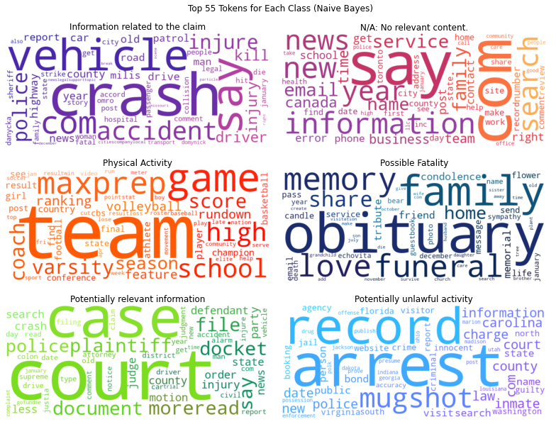
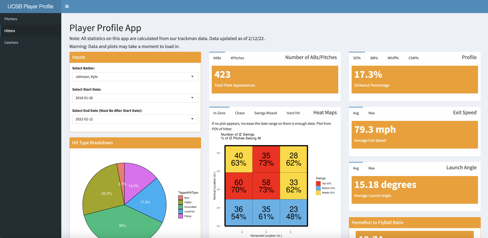

*****

## Data Science Fellowship <i class="fab fa-python"></I>

As a data science fellow for the Central Coast Data Science Partnership, during my winter and spring quarters of my fourth year at UCSB, I was tasked with working with sponsoring company, Carpe Data, in building an insurance fraud classifying model.

Overview:

Carpe Data is an insurance technology company whose headquarters is located in Santa Barbara, California. Carpe Data gathers and analyzes data from sources such as social media platforms and web content in order to provide insurance companies with data solutions. Insurance companies typically receive a significant amount of claims each year; Carpe Data helps to reduce the amount of manual inspection needed to verify these claims through the use of their algorithms.

Our capstone team’s project focuses on building machine learning models in Python that predict whether or not a web page contains evidence about a fraud claim and provide information about the specific type of fraudulent activity that is present.

Our project sponsors are Crystal Zhang and Kevin Neal from Carpe Data. Our mentor is Joshua Bang, and our team members are Tyler Chia, Anum Damani, Annie Huang, Alex Rudolph, and Rithvik Vobbilisetty.

Project Update #1: (https://ucsb-ds-capstone-2022.github.io/projects/carpedata/update1.html)

Project Update #2: (https://ucsb-ds-capstone-2022.github.io/projects/carpedata/update2.html)

{width=65%}

********

## Player Profile Apps (Shiny Web App) <i class="fab fa-r-project"></I>

Continuing my work as a data analytics intern for UCSB's D1 baseball team, I created player profile web applications using RShiny that visualizes various statistics for each type of player on the team.  Pitchers, hitters, and catchers all have different stats displayed as well as differing visualizations. There is one app for pitcher and hitters and another for catcher framing. The goal of these apps was to let the players and coaches see how well they are doing within the specified date range in comparison to the rest of the team. In addition, it serves to show how they have improved over time and what they can do to improve in the future.  Warning: Plots make take a moment to load in due to the amount of data being processed. Plots look best when viewed on a laptop or desktop.

Instructions:

- On the left-hand sidebar, select the baseball position that you want to view stats on: Pitchers or Hitters
- In the "inputs" section, select the name of the player you want to see as well as a date range
- View statistics and beautiful plots

Link to Pitchers & Hitters: (https://tylerchia.shinyapps.io/player_profile/)

Link to Catcher Framing: (https://tylerchia.shinyapps.io/catcher_framing/)

{width=75%}

********

## Relationship Between Pitcher Workload and Ball Variables (Shiny Web App) <i class="fab fa-r-project"></I>

During the Fall of 2021 I started a data analytics internship with UCSB's Data Analytics Team for their Division 1 Baseball Program.  For Fall quarter my main project was to develop an RShiny web application that visualizes the relationship between pitcher workload and ball variable data over time.  The workload data was taken through Motus while the ball variables were obtained through a machine called Trackman.  Workload variables include aspects such as arm strength and mobility while ball variables include things such as velocity, spin rate, strike percentage, release position, and vertical/horizontal break.

Instructions:

- Select a pitcher from the dropdown on the left
- Select “Workload” on the left to see the pitcher’s baseline workload stats and their ranking on the team
- Then select a pitch type from the dropdown and select “Ball Variables” on the left in order to see their pitch metrics over time specific to each pitch type

Link to App: (https://tylerchia.shinyapps.io/Pitcher_Workload_Trackman/)

{width=75%}

************