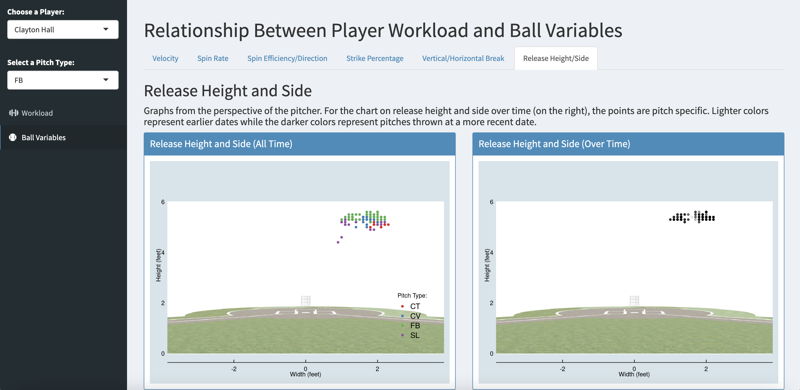

*****

## Relationship Between Pitcher Workload and Ball Variables (Shiny Web App) <i class="fab fa-r-project"></I>

During the Fall of 2021 I started a data analytics internship with UCSB's Data Analytics Team for their Division 1 Baseball Program.  For Fall quarter my main project was to develop an RShiny web application that visualizes the relationship between pitcher workload and ball variable data over time.  The workload data was taken through Motus while the ball variables were obtained through a machine called Trackman.  Workload variables include aspects such as arm strength and mobility while ball variables include things such as velocity, spin rate, strike percentage, release position, and vertical/horizontal break.

Instructions:

- Select a pitcher from the dropdown on the left
- Select “Workload” on the left to see the pitcher’s baseline workload stats and their ranking on the team
- Then select a pitch type from the dropdown and select “Ball Variables” on the left in order to see their pitch metrics over time specific to each pitch type

Link to App: (https://tylerchia.shinyapps.io/Pitcher_Workload_Trackman/)

************