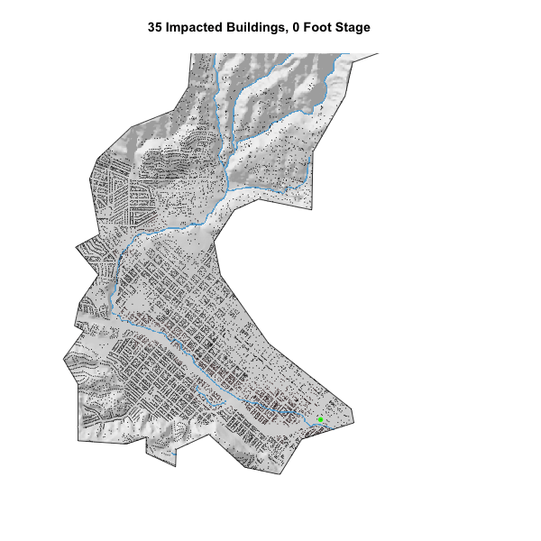

During the summer of 2020, I took six classes, one of which was a GIS course based in R. Out of the three coding classes I took this summer, this GIS course was the most hands-on and provided me with the most experience for data science.  Below is a collection of links for all the projects that I completed.

*****

## Building  a project website

[Website](https://tylerchia.github.io/TylerChia/) | [Github](https://github.com/TylerChia/TylerChia.git)

- In this project, I learned how to utilize both Rmarkdown and Github Pages to author a static website
- Helped me understand file paths and creating directories for raw data, images, Rmarkdown files, and R scripts
- "Committing" files to git and "pushing" changes to GitHub
- Includes a github repository for access to all the code
- Learned how to display my work in a way that is visible to the public

*****

## Tracking COVID-19 Data

[Report](https://tylerchia.github.io/geog-176A-labs/lab-02.html) | [Code](https://raw.githubusercontent.com/TylerChia/geog-176A-labs/master/docs/lab-02.Rmd)

- Learned the basics of data wrangling
- Gained the ability to analyze data sets in order to be able to be able to identify important information as well as merge multiple data sets on recurring variables
- Learned the basics of ggplot2 which allows me to present my data analysis through graphs and other visualizations
- Helped me understand the importance of scale when graphing as two graphs with the same data can imply two very different results

*****

## Distances and the Border Zone

[Report](https://tylerchia.github.io/geog-176A-labs/lab-03.html) | [Code](https://raw.githubusercontent.com/TylerChia/geog-176A-labs/master/docs/lab-03.Rmd)

- Reading in data and creating sf objects
- Transforming both coordinate systems and geometries in order to find distance between objects
- Dropping and converting units from meters to kilometers
- Using ggrepel and gghighlight to create visuals for the data

*****

## Tessellations and Point-In-Polygon

[Report](https://tylerchia.github.io/geog-176A-labs/lab-04.html) | [Code](https://raw.githubusercontent.com/TylerChia/geog-176A-labs/master/docs/lab-04.Rmd)

- Creating functions as a way of making calculations and visualizations easier
- Simplifying geometries in order to speed up the processing time for my computer
- Creating tessellations that describe the extent of a region with geometric shapes
- Different tessellations can show very different results which is the MAUP problem
- Building leaflets that give users an interactive experience with mapping

*****

## Rasters and Remote Sensing

[Report](https://tylerchia.github.io/geog-176A-labs/lab-05.html) | [Code](https://raw.githubusercontent.com/TylerChia/geog-176A-labs/master/docs/lab-05.Rmd)

- Identifying an AOI by using a bounding box created from max/min x and y points
- Download, cache, and load images as multiband raster object and crop domain to AOI
- Creating RGB plots using Landsat 8 Operational Land Imager
- Using Raster Algebra and Raster Thresholding to display flood raster stack through different methods
- Utilizing K-Means algorithm to identify similar features in a continuous field

*****

## Flood Risk in Mission Creek: Past, Present, Future

[Report](https://tylerchia.github.io/geog-176A-labs/lab-06.html) | [Code](https://raw.githubusercontent.com/TylerChia/geog-176A-labs/master/docs/lab-06.Rmd)

- Bringing data into R using Web APIs, specifically the NLDI and USGS gages
- Utilizing OSM to query building and stream data
- Creating HAND rasters for rapid flood assessment in order to see structures that were impacted by inundation
- Creating Flood Inundation Map Libraries as a way to form a 2-D flood warning system

*****

tylerchia7@gmail.com

