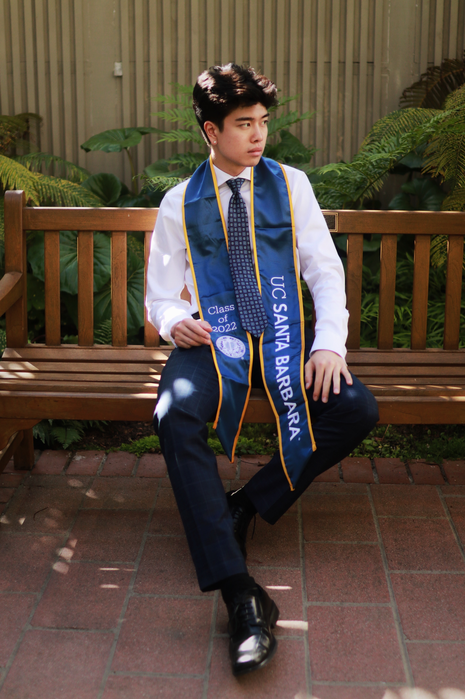

# Hello, My Name is Tyler Chia.

Though I am originally from the city of San Francisco, I am currently a new graduate from the University of California, Santa Barbara. I graduated with degrees in both economics and statistics and data science and minors in spatial science and technology management.  I love to expand my range of knowledge across various topics which is perfect for data science as it is an inter-disciplinary field.  For the summer of 2022, I will be a data science intern at Reyes Coca Cola Bottling as I hope to gain valuable guidance from mentors while simultaneously learning new technical tools.  Through this website, I plan to display my work done through various projects and research that I take on during the next few years. 

*****

tylerchia7@gmail.com

