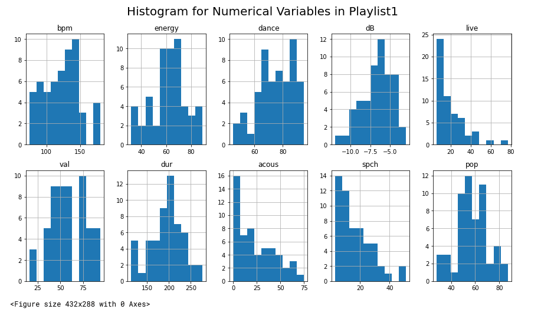

*****

## Trump or Biden? (NLP Tweet Classifier) <i class="fab fa-python"></I>

The goal of this project was to build a classifier that predicts whether a specific tweet was written by Donald Trump or Joe Biden.  The three classifiers that were used were a Naive Bayes Model, a Support Vector Machine, and a Logistic Regression.

- Naive Bayes: 95.125%
- Support Vector Machine: 96.375%
- Logistic Regression: 94.875%

[Code and Report](docs/trump_or_biden.html)

{width=50%}

*****

## Forecasting Short-Term Future COVID-19 Cases Based on Historical Data <i class="fab fa-python"></I>

Goal: 

- Create two time-series forecasting models that predicts the number of new daily COVID cases in each county. 
- Models were trained on the estimated percentage of outpatient doctor visits with confirmed COVID, outpatient doctor visits primarily about COVID-related symptoms, and new hospital admissions with COVID-associated diagnoses: all for 15 counties in California from May 1st, 2020 to November 1st, 2021.  
- Created both an interpretable model in a decision tree regression model as well as a more complex model in a support vector regression model.

Conclusion:

- Decision Tree Regressor testing RMSE was 908.86 and its R-squared value was approximately 0.57.
- Support Vector Regressor produced a testing RMSE of 1403.20 and an R-squared value of approximately -0.025.
- Neither model accurately predicted the number of new daily COVID cases per county using historical data due to wide range of values of the original dataset in addition to the features simply not being good predictors of new COVID cases.
- Decision tree performed much better than the SVR model as it was able to capture the overall trend in the rise and fall of new daily COVID cases.

Python notebook containing code and outputs for **data preparation** can be found [here](docs/data_preparation copy.pdf).

Python notebook containing code and outputs for **model tuning, training, and evaluation** [here](docs/time_series copy.pdf).

**Final Report** for the project can be found [here](docs/197A Final Paper copy.pdf).

**Final Poster** can be found [here](docs/capstone poster copy.pdf).

******

## Predicting The 2021 NBA Draft <i class="fab fa-r-project"></I>

The goal of this project was to use preexisting data from the 2019 NBA draft in addition to NCAA college basketball statistics as a way to create the best classification model to predict whether or not a player would be chosen in the 2021 NBA draft.  I found that the best model out of the ones that I attempted was a logistic regression that used an optimal threshold.  This model had a 93% overall accuracy rate and an 80% true positive rate on the 40% test data split, which was the highest out of all the models considering the overall accuracy was not lowered too drastically.  On July 29th, I will come back to this project as a way to see how many of the 37 individuals that my model predicted to be drafted are actually drafted to the NBA.

Edit (Post July 29, 2021):
Out of the 37 players that my model predicted to be drafted, only 8 of them were actually drafted leaving us with a 21.6% accuracy rate.  With that being said, there 10 players who I predicted to be drafted who went undrafted but eventually signed with NBA G-League teams or are currently on an NBA roster.  Many of the players that I predicted to be drafted actually ended up not even entering the draft and stayed at their respective schools.  In the datatable, I have highlighted the players that were officially drafted by NBA teams in the 2021 draft.

[Code and Report](https://tylerchia.github.io/nbadraft2021/)

*****

## Predicting the 2016 Presidential Election Using Demographic Data <i class="fab fa-r-project"></I>

Goal #1: Predicting whether or not Donald Trump would win a specific county 

- Linear Regression: 0.09 RMSE / Predicted Trump would win 548/613 counties in the test dataset which is 21 more than he actually won. 
- Logistic Regression: 91.4% Accuracy.
- Random Forest: 92.2% Accuracy.
- Adaptive Boosting: 92% Accuracy.

Goal #2: Use K-Means clustering to cluster our data and see if there were any distinct groups driven by specific demographic variables

- Top two clusters that had the highest percentage of counties vote for Trump, were also predominantly white and wealthy.
- The cluster with the lowest percentage of counties that voted for Trump was driven by a higher population of minorities and individuals with lower income per capita.

[Code and Report](https://tylerchia.github.io/2016Election/)

*****

## Evaluating Disney's Pricing Model <i class="fab fa-r-project"></I>
Simple data analysis project done in order to calculate the price elasticity of demand for Disney World single day passes over the past decade using attendance records and average prices.  Doing this allowed me to make conclusions about Disney's pricing strategy relating to their theme parks.

[Code and Report](https://tylerchia.github.io/disneyworld_ticket_elasticity/)

*****

## Spotify Recommender: Ordering Playlists <i class="fab fa-r-project"></I> <i class="fab fa-python"></I>
UCSB Data Science Club Project.  Through this project, my group and I wanted to see if we could order a Spotify playlist based on similarity to another playlist.  In order to do this, we got numerical data from our Spotify playlists and calculated the error between the numerical values of songs from the second playlist and the average, median, and mode values from the first.  This allowed us to make predictions as to which songs were most similar to the playlist.  

[Code and Report](https://tylerchia.github.io/dsclub-spotify-recommender/)

*****

## Mitigation Strategy Proposal: Solar Panels <i class="fab fa-r-project"></I>
Honors Contract Project.  In this project, using a combination of data science methods and thorough research, I proposed a mitigation strategy that requires certain homeowners, based on the purchase price of their house, to install solar panels as a way of reducing carbon emissions.

[Code and Report](https://tylerchia.github.io/Solar-Panel-Proposal/)

*****

## UC x Imagine Datathon Project <i class="fab fa-python"></I>
Right before Fall quarter 2020, I participated in a Datathon hosted by the UC system and ImagineScholar.  The goal of this project was to analyze and visualize data about energy and load shedding in South Africa.  My partner and I decided to see if there is a correlation between instances of load shedding and international/foreign investment to see if load shedding was impacting the economy.

[Code and Report](https://deepnote.com/publish/f31d9b1e-b811-4010-8d3e-ce8e17f35adb)

*****

## 911 Calls in Montgomery County, Pennsylvania <i class="fab fa-python"></I>
During the summer of 2020, I took an online data science class that taught me the basics of data science specifically in python.  The two links below are the two projects that I completed for the class.  The first is based on a dataset pertaining to 911 calls in Montgomery County, Pennsylvania in 2015 and 2016.  The second is based on bank stocks from 2006 to 2015.  Below the links are a few bullet points that display what I learned through these projects.

[Code and Report](https://tylerchia.github.io/Montgomery-County-911-Calls/)

## Bank Stocks <i class="fab fa-python"></I>

[Code and Report](https://tylerchia.github.io/bank-stocks-project/)

- Though these are relatively basic data science projects they gave me practice using python as a language as I am accustomed to using R
- Learned how to use Jupyter Notebooks and Markdown
- Practice using Pandas and Numpy to read in csv files and data wrangle
- Utilized various data visualization libraries such as Matplotlib, Seaborn, Plotly

*****

tylerchia7@gmail.com

