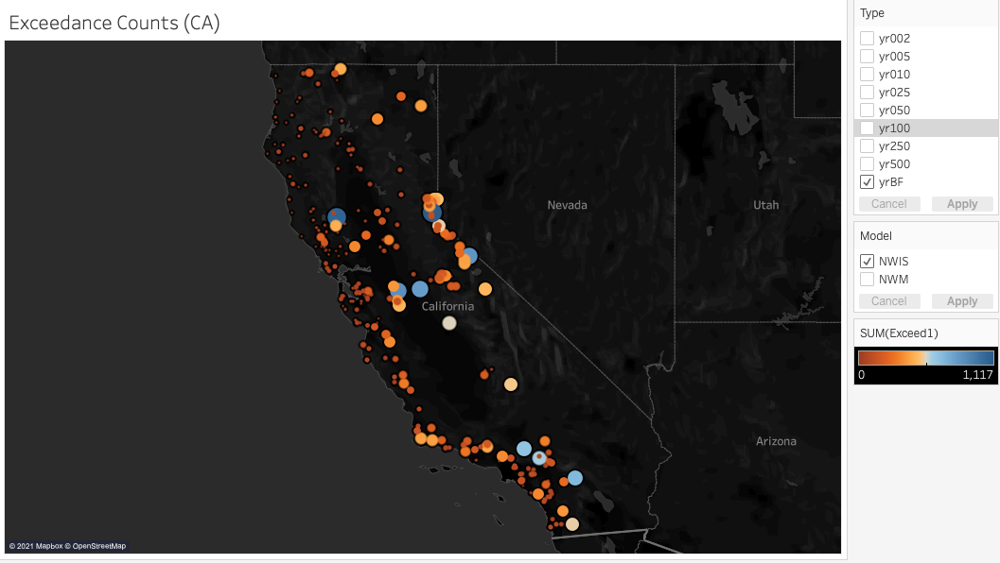

*******

## Hegary Spatial Thinking Lab (Psychology Department)
- Work done under the supervision of Mary Hegarty, a psychology professor at UCSB.  Link to the lab's website can be found [here](https://hegarty-lab.psych.ucsb.edu/)
- Assisted with data analysis of experimental data of an honors student’s thesis project
- Worked with raw experimental data in R to perform exploratory data analysis including visualizations, regression
analyses, and statistical tests

[Code and Report](https://tylerchia.github.io/SpatialThinkingWriteup/)

*******

## Flood Intervals Research (Geography Department) <i class="fab fa-r-project"></I>
- Work done under supervision of Mike Johnson, data scientist, NOAA Affiliate (Water Resource Engineer II), and a PhD candidate in Geography at the University of California, Santa Barbara.  His website and work can be found [here](https://mikejohnson51.github.io/)
- Utilizing RStudio to characterize hydrologic regions of the United States by comparing data from the NOAA National Water Model to USGS streamflow gages
- Developed and finalized a dataframe containing 169,776 observations specific to each USGS site, model, and recurrence interval
- Created several interactive plots and web applications using Tableau and RShiny to display data

[Code and Report](https://tylerchia.github.io/floodintervalswriteup/)

*****

